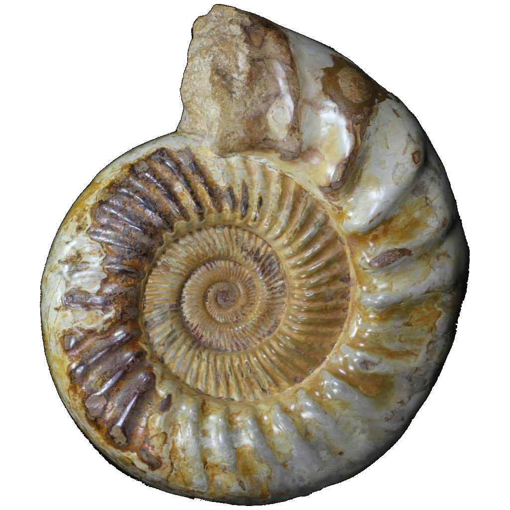

# Attribution

## The Ammonite

The current ammonite icon was commissioned (along with croissantwater below) from [Dzuk] ([x](https://twitter.com/Dzuque/status/1557193734810439680)).  
It is licensed as [CC BY-NC-SA 4.0].

 Emoji versions of the icon, the second is edited to be gold.

## Emoji

*  Inexplicable croissant water emoji ([Commissioned from Dzuk](https://twitter.com/Dzuque/status/1557193734810439680)) ([CC BY-NC-SA 4.0])
*  from [Mutant Standard] by [Dzuk]. ([CC BY-NC-SA 4.0])
*  are color edits of the up and down arrows from the [Mutant Standard] ([CC BY-NC-SA 4.0])
*  ["Open Eye Crying Laughing Emoji"](https://knowyourmeme.com/memes/open-eye-crying-laughing-emoji) from the [Boomer emoji pack by Dzuk](https://dzuk.zone/emoji). ([CC BY-NC-SA 4.0])
*  by [Carter Amelia Davis](https://twitter.com/sweetstench/status/1375883914246381571), featured on [these](https://www.youtube.com/watch?v=1-ir1Hus3ic) [videos](https://www.youtube.com/watch?v=KfcRNFmsmuY).
*  Someone on twitter ([source dead](https://twitter.com/lauramariehart/status/1271484942887813124)) found the original 3D smiley for [this](https://knowyourmeme.com/photos/1027831-reaction-images) and applied a filter to it to achieve the same effect the printer had on it, resulting in a higher quality version. I made it [transparent](https://cdn.discordapp.com/attachments/880468064481722490/999437968609640448/husk_transparent.png), then added the default emoji skin tone to it.
*  The ["Awesome face"](https://knowyourmeme.com/memes/awesome-face-epic-smiley).
*  The Annoying Orange.
*  ["Cereal Guy"](https://knowyourmeme.com/memes/cereal-guy) spitting out his cereal.
*  Reddit Gold icon.
*  Transparent version of the [Sky Kitten](https://web.archive.org/web/20201108072520/https://www.matazone.co.uk/blog/?p=357)
*  Screenshot from [Snowbound Blood](https://deconreconstruction.itch.io/snowbound-blood), a visual novel of the Homestuck fanwork "Vast Error".
*  Some stock image in the style of ["Galaxy Brain"](https://knowyourmeme.com/memes/galaxy-brain).
*  [Skull from Skyrim](https://elderscrolls.fandom.com/wiki/Skull_(Skyrim)?file=Ancient_traveler%2527s_skull.png).
*  Impact font meme caption text "HOW".
*  from the Maplestory 2 [**C**losed **B**eta **T**est](https://orangemushroom.net/2015/01/20/maplestory-2-cbt-begins-tonight/).
*  [Flushed Away videogame](https://en.wikipedia.org/wiki/Flushed_Away_(video_game)) boxart.
*  A picture of Skrillex holding up a pineapple.
*  The cover to Children of Dune by Frank Herbert.
*  Team Fortress 2 PC disc case.
*  Cutout of Konata Izumi dancing in the [Lucky Star opening](https://www.youtube.com/watch?v=6iseNlvH2_s).
*  from Deltarune chapter 2.

## Stickers


## The Original Ammonite

The original ammonite icon comes from [this page][ammonite_old_source] -- I edited it to be transparent.

 Currently unused emoji versions of the original ammonite icon.

[Dzuk]:                https://dzuk.zone/
[Mutant Standard]:     https://mutant.tech/
[CC BY-NC-SA 4.0]:     https://creativecommons.org/licenses/by-nc-sa/4.0/
[ammonite_old_source]: https://web.archive.org/web/20220710170037/https://www.fossilera.com/fossils/13-wide-jurassic-ammonite-fossil-madagascar
